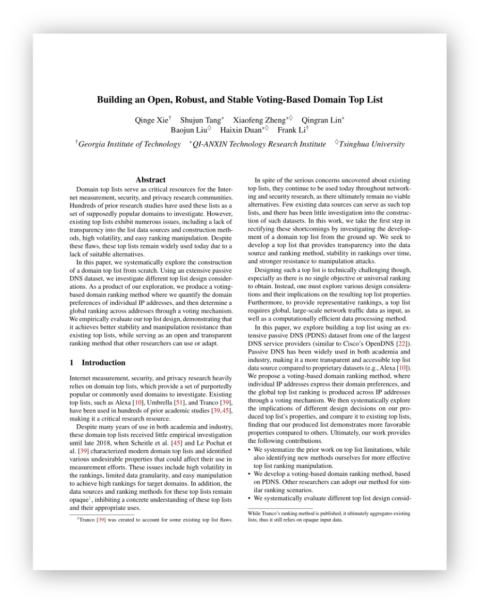

# SecRank

## Introduction

Existing top lists (e.g., Alexa and Cisco Umbrella) exhibit numerous issues, including a lack of transparency into the list data sources and construction methods, high volatility, and easy ranking manipulation. Despite these flaws, these top lists remain widely used today due to a lack of suitable alternatives.

Using an extensive passive DNS dataset, we investigate different top list design considerations. Our list is based on continuous large-scale PDNS data from public DNS resolvers in China. On average, the PDNS dataset consists of ∼500B unique DNS requests from over 70M clients per day, for ∼550M FQDNs. These FQDNs are distributed across an average of 13M SLDs a day, and cover 99.9% of IANA TLDs. We produce a voting-based domain ranking method where we quantify the domain preferences of individual IP addresses, and then determine a global ranking across addresses through a voting mechanism. We empirically evaluate our top list design, demonstrating that it achieves better stability and manipulation resistance than existing top lists (Alexa/Cisco Umbrella/Tranco), while serving as an open and transparent ranking method that other researchers can use or adapt for similar ranking scenarios. Further details can be found in our paper ["Building an Open, Robust,and Stable Voting-Based Internet Domain Top List"](https://www.usenix.org/conference/usenixsecurity22/presentation/xie) (Usenix Security 2022). We provide access to the daily updated top 1M domain list on [https://secrank.cn/topdomain](https://secrank.cn/topdomain). 

  
This repository contains the source code for our ranking implementation (a Scala implementation named `TopFQDNDailyRelease.scala`), described in our paper. The original code is executed in a distributed fashion using Apache Spark on Yarn. 

<p align="right">
<a href="https://www.usenix.org/system/files/sec22fall_xie.pdf">

</p>
 <p></p>
  
## Usage Instructions

For users who are using Apache Hadoop, use IntelliJ IDEA (or other Java IDE with Maven integration) to create a Apache Maven project. Replace the default `pom.xml` file with the `pom.xml` file in this repo, which contains all dependency configurations and package requirements. Please ensure you have installed Java, Scala, Maven, Apache Spark, and Hadoop on your machine. This implementation uses Java 1.8, Maven JDK 1.8, Scala 2.11.8, Apache Spark 2.4.5 and Hadoop 2.7.2 (you can also find the configurations in the `pom.xml` file).

  
Next, put `TopFQDNDailyRelease.scala` in the path `$YOUR_PROJECT_PATH$/src/main/java/com/secrank/examples/`. Please modify `trends_path` and `access_path` in `TopFQDNDailyRelease.scala` to your own input traffic data paths on HDFS, and also accordingly modify the output paths.
  
After adapting the code for ranking your own network traffic data, package your maven project to a .JAR file using the following command (you can also package the project directly using IntelliJ):
```
mvn clean package -Dmaven.test.skip=true
```
<p>Upload the package (e.g., toplist.jar) to your Spark client machine, and run `submit.sh` in this repo to submit the Spark application to YARN clusters. Remember to modify configuration parmeters in `submit.sh` (You can also follow the instructions in the [official documentation](https://spark.apache.org/docs/latest/submitting-applications.html)).</p>
  
  - Modify the path in the first line to the path that installs the spark-submit script on your machine;
  - `--master`: The master URL for the cluster (e.g. yarn or spark://23.195.26.187:7077);
  - `--deploy-mode`: Whether to deploy your driver on the worker nodes (cluster) or locally as an external client (client) (default: client);
  - `--class`: The entry point for your application (e.g. com.secrank.examples.TopFQDNDailyRelease).
  - `--queue`: Set up queue name if you are using YARN.

According to your data amount, modify `--driver-cores`, `--driver-memory`, `--num-executors`, `--executor-cores` and `--executor-memory` to your custom resource allocation to execute the job. For example, we use 300 executors each configured with 2 cores and 4 GB of memory for our daily top 1M list computation (check the details in our paper).


## Citation

If you use our ranking method or the constructed top list (SecRank) in your research, please cite our work using this Bibtex entry:
```
@inproceedings{xietoplist_usenix22,
  title = {Building an Open, Robust, and Stable {Voting-Based} Domain Top List},
  author = {Xie, Qinge and Tang, Shujun and Zheng, Xiaofeng and Lin, Qingran and Liu, Baojun and Duan, Haixin and Li, Frank},
  year = {2022},
  address = {Boston, MA},
  url = {https://www.usenix.org/conference/usenixsecurity22/presentation/xie},
  publisher = {USENIX Association},
  month = aug,
}
```
